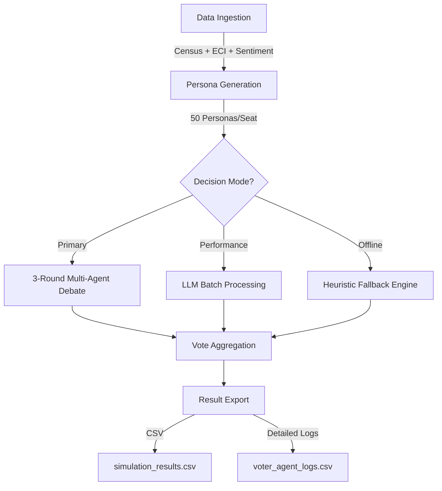
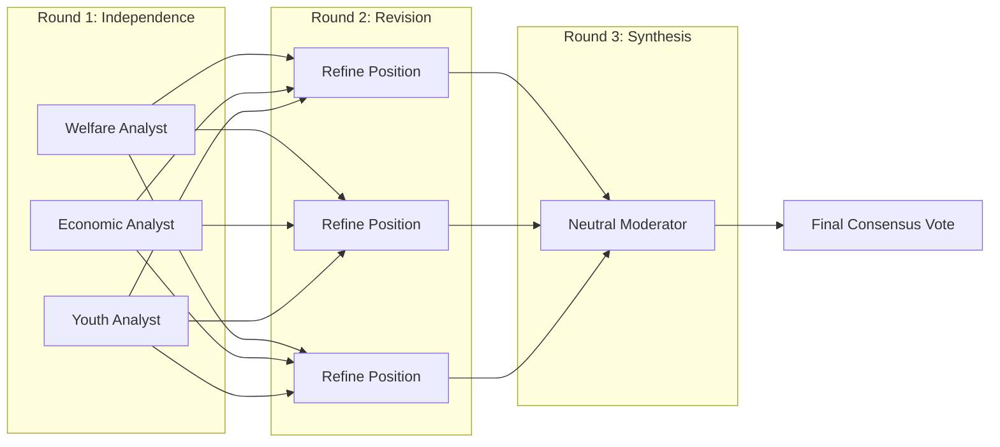

# 🗳️ VoterSim TN '26

VoterSim TN '26 is a high-fidelity, agent-based electoral simulation engine designed for the 2026 Tamil Nadu Assembly Elections. It leverages Large Language Models (LLMs) to simulate granular voter behavior across all 234 constituencies.

## 🚀 Key Features

- **Multi-Agent Debate Engine**: Uses a 3-round debate model (specialist analysis, peer-review, and neutral synthesis) to simulate complex political decision-making.
- **Census-Grounded Personas**: Generates deterministic voter personas based on District-level Census 2011 data, including granular occupation pools and concern tags.
- **Dynamic Sentiment Mapping**: Incorporates real-time candidate popularity, anti-incumbency scores, and regional "Vijay factor" (TVK) modifiers.
- **Interactive Dashboard**: A built-in Streamlit dashboard for visualizing seat projections, turnout surges, and individual voter agent logs.

## 🏗️ Architecture

```text
root/
├── core/
│   ├── voter_agent_engine.py    # Main simulation loop (Thread-parallel)
│   ├── ollama_async_client.py   # Unified LLM client (Google Gemini / Ollama)
│   └── sentiment_scraper.py     # Political sentiment weighting
├── utils/
│   ├── persona_generator.py     # Deterministic demographic factory
│   ├── district_occupations.py  # Granular district-level data
│   └── data_engine.py           # Dashboard data orchestrator
├── data/                       # Census & ECI historical data
├── tools/                      # Diagnostic & audit utilities
└── app.py                      # Streamlit UI
```

## ⚙️ Simulation Engine

The core of VoterSim TN '26 is a high-fidelity simulation engine that models the decision-making process of individual voter personas.

### 🔄 Simulation Pipeline
The engine follows a structured pipeline from data ingestion to final result export.



### 🧠 3-Round Multi-Agent Debate
This is the "High-Fidelity" mode where political nuances are captured through collaborative and adversarial reasoning.

1.  **Round 1: Independent Perspective**:
    *   **Welfare Analyst**: Evaluates based on incumbent schemes (Magalir Urimai Thogai, free bus, etc.).
    *   **Economic Analyst**: Focuses on inflation, electricity tariffs, and anti-incumbency.
    *   **Youth Analyst**: Tracks the "Vijay factor" (TVK) and social media disruption.
2.  **Round 2: Peer Review & Revision**:
    *   Analysts exchange their Round 1 reasoning.
    *   Each analyst revises their position if the other perspectives present a more compelling case for the specific voter profile.
3.  **Round 3: Neutral Synthesis**:
    *   A **Neutral Moderator** reviews the entire debate transcript.
    *   The moderator synthesizes a final vote split and a coherent reason that aligns with the voter's persona.



### 📉 Decision Factors
The engine processes over 20+ variables for every voter agent:
- **Demographics**: Age, Gender, Occupation, Literacy, Income bracket.
- **Contextual**: 2021 victory margin, incumbent re-contesting status, SC/ST population density.
- **Dynamic**: Real-time candidate sentiment scores (-100 to +100).
- **Triggers**: Turnout surge types (Base Mobilisation vs. Anti-Incumbency).


## 🛠️ Installation

1. Clone the repository:
   ```bash
   git clone https://github.com/your-repo/votersim_tn_26.git
   cd votersim_tn_26
   ```

2. Install dependencies:
   ```bash
   pip install -r requirements.txt
   ```

3. Configure LLM Providers:
   - Set `GEMINI_API_KEY` for Google Flash 2.0 (High throughput).
   - Or ensure `Ollama` is running locally with `llama3.2:1b`.

## 📈 Usage

### Run Simulation
To run the full 234-constituency simulation:
```bash
python core/voter_agent_engine.py
```

### Launch Dashboard
To visualize the results:
```bash
streamlit run app.py
```

### Technical Audit
Verify the engine integrity:
```bash
python tools/tech_audit.py
```

## ⚖️ Disclaimer
This simulation is a diagnostic tool for research purposes only. It is not an exit poll or an official prediction. All voter personas are synthetic and grounded in statistical averages.

## 📜 License
MIT License - See [LICENSE](LICENSE) for details.
